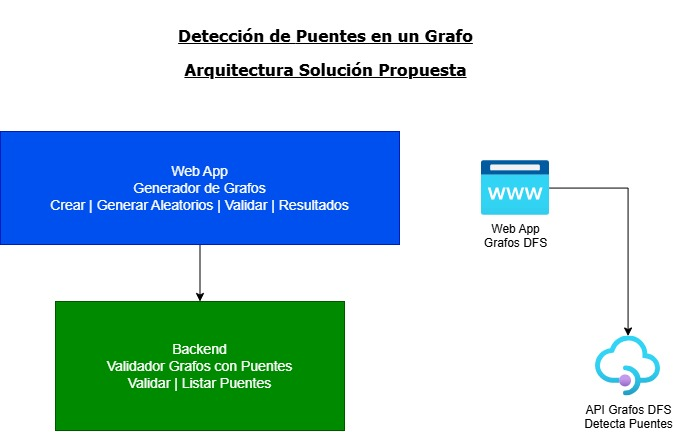
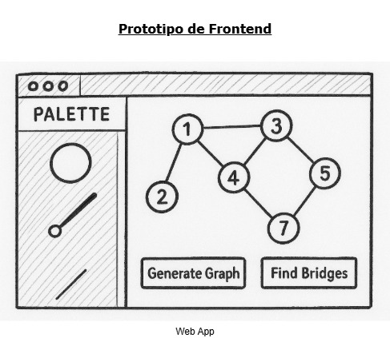
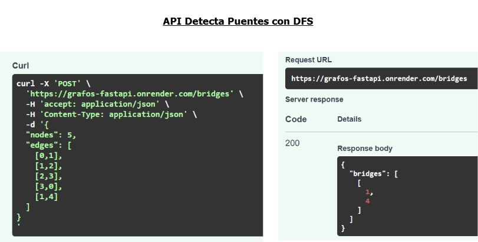
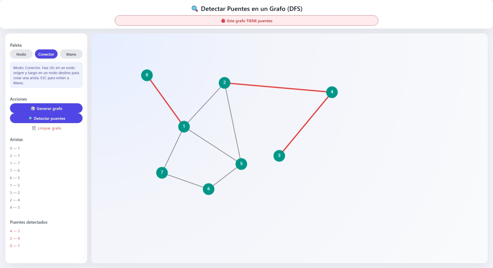

# Detección de Puentes en Grafos utilizando DFS  
### Informe académico — Algoritmos y Estructura de Datos  
### Universidad de Ingeniería y Tecnología (UTEC) — 2025

---

## 1. Introducción

El presente documento describe el diseño e implementación de una solución web para la **detección de puentes en grafos no dirigidos** mediante el algoritmo de búsqueda en profundidad (**Depth-First Search, DFS**).  

La solución integra tres componentes principales:

- Un **frontend web** que permite construir y visualizar grafos de forma interactiva.
- Un **backend desarrollado en Python con FastAPI**, responsable del procesamiento algorítmico y de la detección de aristas puente.
- Un **despliegue en la nube** que permite el acceso a la herramienta a través de un navegador web, sin necesidad de instalación local.

El objetivo académico es proporcionar una herramienta que facilite la comprensión del concepto de puentes en grafos, permitiendo a los estudiantes experimentar con diferentes estructuras y observar, de forma inmediata, el impacto de eliminar dichas aristas en la conectividad del grafo.

---

## 2. Demo en línea de la aplicación web

La aplicación se encuentra desplegada y disponible para su uso en el siguiente enlace:

- **Aplicación web (demo en línea):**  
  https://grafos-detecta-puentes-dfs.netlify.app/

La interfaz permite:

- Crear nodos sobre un lienzo interactivo.
- Conectar nodos para formar aristas.
- Mover libremente los nodos para mejorar la visualización.
- Generar grafos aleatorios conectados.
- Enviar el grafo al backend y obtener, de forma automática, las aristas que son puentes.

---

## 3. Arquitectura de la solución

La arquitectura propuesta sigue un enfoque de separación de responsabilidades entre la capa de presentación (frontend) y la capa de servicios (backend). El frontend se comunica con el backend a través de una API REST desplegada en la nube.

A continuación, se presenta el diagrama de arquitectura general:



En términos generales:

- El **frontend** se encuentra desplegado en **Netlify**, servido como una aplicación estática basada en HTML, CSS y JavaScript.
- El **backend** se ejecuta en **Render**, exponiendo una API para la detección de puentes mediante DFS.
- La comunicación se realiza mediante solicitudes HTTP, principalmente a través del endpoint `POST /bridges`.

---

## 4. Prototipo inicial de la interfaz de usuario

Antes de desarrollar la interfaz definitiva, se elaboró un prototipo de baja fidelidad que permitió definir:

- La ubicación de la paleta de herramientas.
- La zona de trabajo o lienzo donde se dibujan los grafos.
- La disposición de los botones de acción principales.

Este prototipo se muestra en la siguiente imagen:



El prototipo sirvió como guía para la construcción de la versión final del frontend, procurando mantener una interfaz limpia, clara y orientada a la experimentación académica.

---

## 5. Frontend interactivo para la edición de grafos

El frontend fue implementado utilizando HTML, CSS y JavaScript puro, con un énfasis en la usabilidad y en la claridad visual para el alumno. Entre las funcionalidades principales se encuentran:

### 5.1 Gestión de nodos

- Creación de nodos mediante clic sobre el lienzo.
- Asignación automática de identificadores numéricos consecutivos.
- Posibilidad de mover nodos arrastrándolos con el cursor, para mejorar la legibilidad del grafo.

### 5.2 Gestión de aristas

- Creación de aristas seleccionando un nodo de origen y luego un nodo de destino mediante la herramienta de **conector**.
- Visualización de la lista de aristas existentes en la barra lateral.
- Eliminación de aristas mediante un menú contextual asociado a cada una de ellas.

### 5.3 Interacciones adicionales

- Generación automática de grafos aleatorios conectados (entre 5 y 8 nodos), con una probabilidad configurada de que contengan puentes.
- Resaltado visual de las aristas puente una vez que el backend devuelve el resultado.
- Actualización del mensaje de estado (por ejemplo, indicando si el grafo tiene o no puentes).

Todo esto se realiza sin recargar la página, manteniendo una experiencia fluida y adecuada para trabajo en laboratorio o demostraciones en clase.

---

## 6. Backend: detección de puentes mediante DFS

El backend ha sido desarrollado utilizando **FastAPI**, un framework ligero y eficiente para la construcción de APIs en Python. El servicio principal expone el endpoint:

- `POST /bridges`

El cuerpo de la solicitud incluye la representación del grafo:

```json
{
  "nodes": 5,
  "edges": [
    [0, 1],
    [1, 2],
    [2, 3],
    [3, 0],
    [1, 4]
  ]
}
```

El backend representa el grafo de manera interna usando listas de adyacencia y ejecuta el algoritmo DFS para identificar las aristas que, al ser removidas, incrementan el número de componentes conexas del grafo. El resultado se devuelve en el siguiente formato:

```json
{
  "bridges": [
    [1, 4]
  ]
}
```

La siguiente figura muestra un ejemplo de consumo del servicio y la respuesta obtenida:



---

## 7. Demostración del sistema en funcionamiento

En la siguiente captura puede observarse la aplicación en funcionamiento. Se aprecia:

- El grafo dibujado por el usuario o generado aleatoriamente.
- Las aristas puente destacadas visualmente.
- La lista de aristas y puentes en la barra lateral.
- El mensaje de estado indicando si el grafo presenta puentes.



Esta demostración pone en evidencia la integración correcta entre el editor de grafos, la API de detección de puentes y la visualización de resultados en tiempo casi real.

---

## 8. Instrucciones de instalación y ejecución local

Aunque la solución está disponible en línea, también es posible ejecutarla de manera local para fines de prueba o desarrollo.

### 8.1 Frontend

1. Ubicarse en la carpeta del frontend:

   ```bash
   cd frontend
   ```

2. Levantar un servidor estático simple (por ejemplo, con Python):

   ```bash
   python -m http.server 5500
   ```

3. Abrir en el navegador:

   ```text
   http://localhost:5500
   ```

4. Utilizar la interfaz para crear nodos, conectarlos y ejecutar la detección de puentes.

### 8.2 Backend

1. (Opcional) Crear y activar un entorno virtual:

   ```bash
   python -m venv venv
   # Windows
   venv\Scripts\activate
   # Linux / macOS
   source venv/bin/activate
   ```

2. Instalar las dependencias necesarias:

   ```bash
   pip install -r requirements.txt
   ```

3. Iniciar el servidor FastAPI:

   ```bash
   cd backend
   uvicorn app:app --reload --port 8000
   ```

4. Probar el endpoint principal:

   - URL: `http://localhost:8000/bridges`  
   - Método: `POST`  
   - Cuerpo: grafo en formato JSON (nodos y lista de aristas).

---

## 9. Conclusiones

- Se ha implementado una solución completa que permite **visualizar y analizar puentes en grafos no dirigidos**, integrando teoría de grafos con desarrollo web y servicios en la nube.  
- El editor visual facilita el aprendizaje, ya que el estudiante puede construir grafos manualmente o generar instancias aleatorias y observar el resultado del algoritmo de forma inmediata.  
- El backend en FastAPI demuestra ser una alternativa adecuada para la implementación de algoritmos de este tipo, ofreciendo buen rendimiento y una interfaz clara para la integración con aplicaciones web.  
- El despliegue mediante Netlify (frontend) y Render (backend) demuestra la viabilidad de exponer este tipo de herramientas a la comunidad académica, sin requerir la instalación de software adicional por parte del usuario final.

---

## 10. Enlaces relevantes

- **Aplicación web (demo en Netlify):**  
  https://grafos-detecta-puentes-dfs.netlify.app/

- **API de detección de puentes (Render):**  
  https://grafos-fastapi.onrender.com/docs

---

## 11. Autores

- Fernando Gutiérrez  
- Piero Palacios  
- Winston Flores
